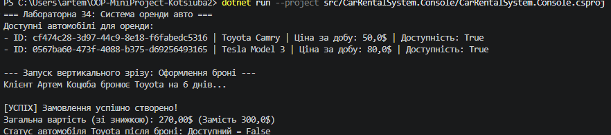
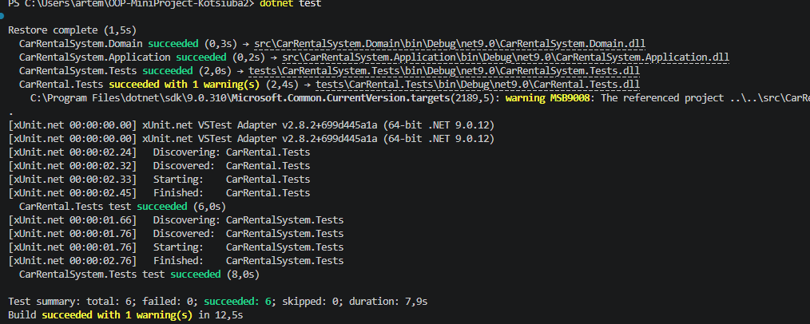

# Car Rental System — Підсумковий міні-проєкт

## 1. Опис проєкту
**Car Rental System** — це консольний застосунок на платформі .NET 8, призначений для автоматизації процесів оренди та бронювання автомобілів. [cite_start]Проєкт розробляється ітеративно з чітким дотриманням принципів **Clean Architecture** (Чистої архітектури) та **SOLID**[cite: 14, 27, 157].

[cite_start]На першій ітерації (Лабораторна 34) реалізовано базову предметну модель із захистом бізнес-правил (інваріантів) та перший вертикальний зріз для сценарію оформлення броні клієнтом[cite: 3, 22, 101, 112].

---

## 2. Структура проєкту (Шари архітектури)
[cite_start]Рішення розділене на незалежні шари відповідно до архітектурних вимог[cite: 153, 157]:

- **`src/CarRentalSystem.Domain`** — ядро системи. [cite_start]Містить сутності предметної області (`Vehicle`, `Car`, `Customer`, `RentalOrder`) та інтерфейси контрактів (`IRentalRepository`)[cite: 36, 109]. [cite_start]Не має зовнішніх залежностей[cite: 100].
- **`src/CarRentalSystem.Application`** — шар бізнес-логіки. [cite_start]Містить сервіси (`RentalService`), які оркеструють виконання користувацьких сценаріїв[cite: 36, 110]. Залежить тільки від Домену.
- **`src/CarRentalSystem.Infrastructure`** — шар інфраструктури. [cite_start]Реалізує збереження даних у пам'яті (`InMemoryRentalRepository`)[cite: 40, 111]. Залежить від Домену та Application.
- [cite_start]**`src/CarRentalSystem.Console`** — шар інтерфейсу користувача (UI)[cite: 44]. [cite_start]Текстове меню для взаємодії та запуску вертикального зрізу системи[cite: 22, 112].
- [cite_start]**`tests/CarRentalSystem.Tests`** — проєкт для автоматичного юніт-тестування бізнес-правил доменної моделі[cite: 45, 122].

---

## 3. Інструкція із запуску та тестування

Для роботи із застосунком переконайтеся, що у вас встановлено **.NET SDK 8.0** або новішої версії.

### Запуск консольного застосунку (Вертикальний зріз)
[cite_start]Щоб запустити головний сценарій створення замовлення та переглянути вивід у консоль, виконайте[cite: 112, 116]:
```bash
dotnet run --project src/CarRentalSystem.Console/CarRentalSystem.Console.csproj

### Запуск ТЕСТІВ 
dotnet test
