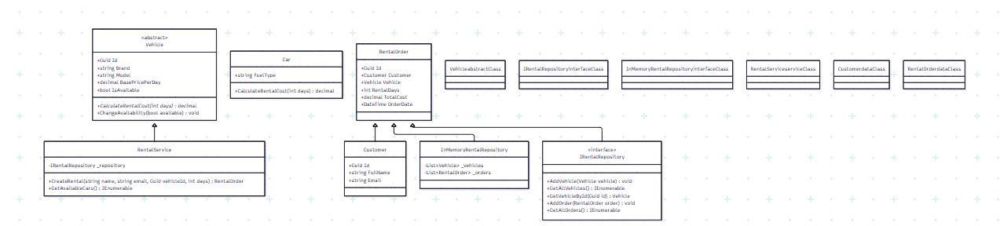

# Діаграма класів (Class Diagram) — Ітерація 1

```mermaid
classDiagram
    class Vehicle {
        <<abstract>>
        +Guid Id
        +string Brand
        +string Model
        +decimal BasePricePerDay
        +bool IsAvailable
        +CalculateRentalCost(int days)* decimal
        +ChangeAvailability(bool available) void
    }

    class Car {
        +string FuelType
        +CalculateRentalCost(int days) decimal
    }

    class Customer {
        +Guid Id
        +string FullName
        +string Email
    }

    class RentalOrder {
        +Guid Id
        +Customer Customer
        +Vehicle Vehicle
        +int RentalDays
        +decimal TotalCost
        +DateTime OrderDate
    }

    class IRentalRepository {
        <<interface>>
        +AddVehicle(Vehicle vehicle) void
        +GetAllVehicles() IEnumerable
        +GetVehicleById(Guid id) Vehicle
        +AddOrder(RentalOrder order) void
        +GetAllOrders() IEnumerable
    }

    class InMemoryRentalRepository {
        -List~Vehicle~ _vehicles
        -List~RentalOrder~ _orders
    }

    class RentalService {
        -IRentalRepository _repository
        +CreateRental(string name, string email, Guid vehicleId, int days) RentalOrder
        +GetAvailableCars() IEnumerable
    }

    Vehicle <|-- Car
    RentalOrder --> Customer
    RentalOrder --> Vehicle
    RentalService --> IRentalRepository
    IRentalRepository <|.. InMemoryRentalRepository
    
    ### 4. `docs/sequence-diagram.md`
*(Ця діаграма показує, як твій успішний консольний тест покроково пройшов крізь усі шари архітектури[cite: 21, 114].)*

```markdown
# Діаграма послідовності (Sequence Diagram) — Створення броні

```mermaid
sequenceDiagram
    autonumber
    actor User as Користувач (Console)
    participant Service as RentalService (Application)
    participant Domain as RentalOrder (Domain)
    participant Repo as InMemoryRentalRepository (Infrastructure)

    User->>Service: CreateRental(name, email, vehicleId, days)
    Service->>Repo: GetVehicleById(vehicleId)
    Repo-->>Service: Повертає об'єкт Car
    
    Note over Service, Domain: Валідація інваріантів та створення броні
    Service->>Domain: new RentalOrder(customer, car, days)
    Domain->>Domain: Car.ChangeAvailability(false)
    Domain-->>Service: Об'єкт RentalOrder (успішно створено)

    Service->>Repo: AddOrder(order)
    Service-->>User: Вивід успіху та TotalCost в консоль